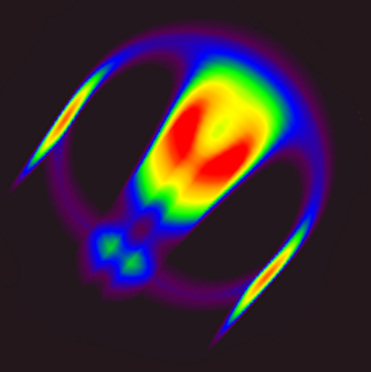

# Lenia



This project is based on Lenia, the continuous cellular automaton created by Bert Wang-Chak Chan. The original description can be found in the paper _Lenia: Biology of Artificial Life_.
Chan also has his own Python implementation, which you should check out: https://github.com/Chakazul/Lenia

Lenia is a smooth, continuous variant of cellular automata. Instead of hard binary cells and rigid update rules, it evolves floating-point fields through a differentiable growth rule and a radial interaction kernel, producing persistent moving patterns that often look surprisingly lifelike.

This project is an interactive real-time Lenia application written in C++, CUDA, and OpenGL. It turns Lenia into an interactable simulation: you can load cataloged creatures, switch between species, draw into the world, stamp organisms into the field, and actively steer an animal by applying asymmetric perturbations while it moves.

## What This Project Does

This implementation focuses on treating Lenia creatures less like passive simulations and more like controllable agents inside a responsive GPU application.

- Loads a large library of Lenia animals from [resources/animals_dim.csv](resources/animals_dim.csv) (These are collected from the original project)
- Builds each creature from its encoded pattern, kernel parameters, and taxonomy metadata
- Runs the simulation on a 1024x1024 field in real time
- Lets you cycle through animals, resize them, reset the world, and inspect live stats
- Supports direct editing with circular drawing and stencil placement modes
- Includes a control mode that uses the creature's direction of motion and center of mass so you can nudge it left or right while it is swimming across the toroidal world

## Media

<table>
	<tr>
		<td>
			
		</td>
		<td>
			<video src="resources/videos/first.mp4" controls muted playsinline width="100%"></video>
		</td>
	</tr>
	<tr>
		<td>
			Main application image.
		</td>
		<td>
			<strong>First successful Python run.</strong> This is the first point where the Lenia update loop behaved correctly end-to-end in Python.
		</td>
	</tr>
</table>

<video src="resources/videos/wall.mp4" controls muted playsinline width="100%"></video>

<strong>Wall interaction debug view.</strong> This clip shows an animal interacting with a wall. The top left is the main image, the top right shows the FFT version of the animal multiplied with the FFT of the kernel, and the bottom left shows the shifted version.

## Interaction Model

The current application is keyboard-and-mouse driven and built around immediate visual feedback.

- `Left` / `Right` in normal mode: switch to the previous or next animal
- `C`: toggle control mode
- `Left` / `Right` in control mode: steer the current animal by injecting "zero"-mass orthogonal to its current movement vector
- `Up` / `Down`: change simulation scale (thanks to FFT, this is O(n log n), and not O(n^2), like in a traditional convolution)
- `R`: reset the current organism
- `P`: pause or resume
- `D`: circular draw mode
- `Q`: stencil placement mode using the selected animal
- Mouse wheel in draw mode: adjust draw radius
- Left mouse button: add cells
- Right mouse button: erase cells in circle mode
- `I`: show runtime stats and kernel previews
- `B`, `G`, `M`: toggle bounding boxes, grid, and center-of-mass overlays

The steering behavior is the distinctive part. The simulation continuously tracks center of mass and heading, then uses that direction vector to place perturbations to the left or right of the animal.

## Technical Overview

The project is built to keep almost all heavy work on the GPU.

### CUDA

CUDA handles the simulation core.

- The simulation state is stored in GPU-side buffers and updated every frame. These buffers are shared between OpenGL and CUDA.
- Convolution is performed with cuFFT rather than direct spatial convolution, which keeps large-kernel Lenia updates practical on a 1024x1024 field
- A custom CUDA kernel applies the post-FFT update step, combines the inverse transform with the Lenia growth function, and writes the next state back into the simulation field
- The code also computes motion-related statistics such as mass and toroidal center of mass so the application can expose live control and diagnostics

The important design choice here is frequency-domain evolution: instead of looping over every cell and every kernel sample in the spatial domain, the code transforms the field once, multiplies by the precomputed organism kernel spectrum, and transforms back.

### OpenGL

OpenGL is used as both presentation layer and GPU data bridge.

- The field is backed by shader storage buffer objects and rendered directly through the graphics pipeline
- GLFW, GLAD, and ImGui provide the window, context, input handling, and overlay UI
- OpenGL textures are also used to preview the organism mask, padded kernel, and FFT magnitude in the interface
- CUDA/OpenGL interop lets the renderer and simulation share buffers without round-tripping field data through the CPU every frame

That interop path is what keeps the app responsive. The simulation writes GPU memory that the renderer can immediately visualize, so rendering the world is mostly a matter of drawing a fullscreen quad and overlaying UI.

## Python Experiments

Before moving everything into CUDA, I used [resources/fft_numba.py](resources/fft_numba.py) to prototype the FFT pipeline and generate quick Matplotlib-based debug animations. That was substantially easier to inspect than debugging the same ideas inside CUDA kernels, and it helped validate padding, FFT multiplication, inverse transforms, and shift behavior before porting them to the GPU implementation.

### Thrust

Thrust is used to express high-throughput GPU transforms and reductions cleanly.

- It converts host-side floating-point buffers into complex GPU buffers for FFT input
- It builds the precomputed FFT representation of each animal kernel
- It applies pointwise transforms on device memory during field updates and edit operations such as circular drawing
- It performs transform-reduce passes that summarize each frame into higher-level data like mass, bounding information, and toroidal moments

This is a good fit for Lenia because a lot of the work is data-parallel but not especially complicated.

### Why It Is Fast

- CUDA performs the numerical update on device memory
- cuFFT turns wide Lenia convolutions into efficient frequency-domain multiplications
- Thrust handles the elementwise transforms and reductions that would otherwise become custom kernels or CPU bottlenecks
- OpenGL renders directly from shared GPU buffers
- The CPU mainly orchestrates input, UI, and resource setup instead of touching the full simulation grid every frame

That architecture is what makes this project feel interactive instead of batch-oriented.

## Build Notes

This is a CMake project configured for C++20 and CUDA.

Requirements:

- A CUDA-capable NVIDIA GPU (>= CUDA Version 89, tested on a 4070Ti)
- CUDA Toolkit with cuFFT
- CMake 3.24+
- A C++20 compiler (tested on Microsoft's CL)
- OpenGL drivers on the host system

On Windows with Visual Studio and CMake, a typical flow is:

```powershell
cmake -S . -B build
cmake --build build --config Release
.\build\Release\lenia.exe
```

## Credits And Original Material

This project builds on the original Lenia work by Bert Wang-Chak Chan.

- Official Lenia page: <https://chakazul.github.io/lenia.html>
- Original paper: Bert Wang-Chak Chan, _Lenia: Biology of Artificial Life_, Complex Systems 28(3), 2019. <https://arxiv.org/abs/1812.05433>
- Original Lenia code and demos: <https://github.com/Chakazul/Lenia>
