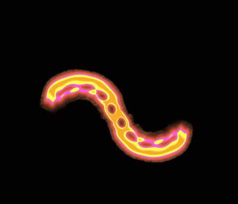
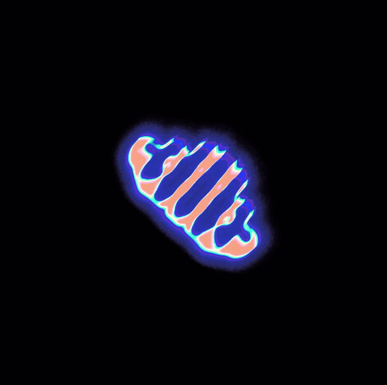

# Lenia

<p align="center">
		
</p>

This project is a native implementation of Lenia, the continuous cellular automaton created by Bert Wang-Chak Chan. The original description can be found in the paper _Lenia: Biology of Artificial Life_.
Chan also has his own Python implementation, which you should check out: https://github.com/Chakazul/Lenia

Lenia is a smooth, continuous variant of cellular automata. Instead of hard binary cells and rigid update rules, it evolves floating-point fields through a differentiable growth rule and a radial interaction kernel, producing persistent moving patterns that often look surprisingly lifelike.

This project is an interactive real-time Lenia application written in C++, CUDA, and OpenGL. It turns Lenia into an interactable simulation: you can load cataloged creatures, switch between species, draw into the world, stamp organisms into the field, and actively steer an animal by applying asymmetric perturbations while it moves.

## Example Animals

<p align="center">
<table>
	<tr>
		<th style="font-size:20px">Name</th>
		<th style="font-size:20px">Preview</th>
	</tr>
	<tr>
		<td style="font-size:20px">Orbium Unicaudatus (Controlled via Keyboard)</td>
		<td></td>
	</tr>
	<tr>
		<td style="font-size:20px">Aurokronium Cavus</td>
		<td></td>
	</tr>
	<tr>
		<td style="font-size:20px">Decahelicium</td>
		<td></td>
	</tr>
	<tr>
		<td style="font-size:20px">Decapteryx Arcus Labens</td>
		<td></td>
	</tr>
	<tr>
		<td style="font-size:20px">Pentacaudokronium Cavus</td>
		<td></td>
	</tr>
	<tr>
		<td style="font-size:20px">Pentaquadrium Metamorpha</td>
		<td></td>
	</tr>
	<tr>
		<td style="font-size:20px">Pentaurium Perlongus</td>
		<td></td>
	</tr>
</table>
</p>

## What This Project Does

This implementation focuses on treating Lenia creatures less like passive simulations and more like controllable agents inside a responsive GPU application.

- Loads a large library of Lenia animals from [resources/animals_dim.csv](resources/animals_dim.csv) (These are collected from the original project)
- Builds each creature from its encoded pattern, kernel parameters, and taxonomy metadata
- Runs the simulation on a 1024x1024 field in real time
- Lets you cycle through animals, resize them, reset the world, and inspect live stats
- Supports direct editing with circular drawing and stencil placement modes
- Includes a control mode that uses the creature's direction of motion and center of mass so you can nudge it left or right while it is swimming across the toroidal world
- Applies a post-processing shader over the animals that can be controlled for various effects

## Interaction Model

The current application is keyboard-and-mouse driven and built around immediate visual feedback.

- `Left` / `Right` in normal mode: switch to the previous or next animal
- `C`: toggle control mode
- `Left` / `Right` in control mode: steer the current animal by injecting "zero"-mass orthogonal to its current movement vector
- `Up` / `Down`: change simulation scale (thanks to FFT, this is O(n log n), and not O(n^2), like in a traditional convolution)
- `R`: reset the current organism
- `P`: pause or resume
- `D`: circular draw mode
- `Q`: stencil placement mode using the selected animal
- Mouse wheel in draw mode: adjust draw radius
- Left mouse button: add cells
- Right mouse button: erase cells in circle mode
- `I`: show runtime stats and kernel previews
- `B`, `G`, `M`: toggle bounding boxes, grid, and center-of-mass overlays
- `X`: Shader Control Panel

The steering behavior is the distinctive part. The simulation continuously tracks center of mass and heading, then uses that direction vector to place perturbations to the left or right of the animal. This doesn't work for all animals, but for those with a clear, linear motion, the effect is quite seamless.

## Technical Overview

The project is built to keep almost all heavy work on the GPU.

### CUDA

CUDA handles the simulation core.

- The simulation state is stored in GPU-side buffers and updated every frame. These buffers are shared between OpenGL and CUDA.
- Convolution is performed with cuFFT rather than direct spatial convolution, which keeps large-kernel Lenia updates practical on a 1024x1024 field
- A custom CUDA kernel applies the post-FFT update step, combines the inverse transform with the Lenia growth function, and writes the next state back into the simulation field
- The code also computes motion-related statistics such as mass and toroidal center of mass so the application can expose live control and diagnostics

The important design choice here is frequency-domain evolution: instead of looping over every cell and every kernel sample in the spatial domain, the code transforms the field once, multiplies by the precomputed organism kernel spectrum, and transforms back.

### OpenGL

OpenGL is used as both presentation layer and GPU data bridge.

- The field is backed by shader storage buffer objects (SSBOs) and rendered directly through the graphics pipeline
- GLFW, GLAD, and ImGui provide the window, context, input handling, and overlay UI
- OpenGL textures are also used to preview the organism mask, padded kernel, and FFT magnitude in the interface
- CUDA/OpenGL interop lets the renderer and simulation share buffers without round-tripping field data through the CPU every frame

The simulation writes GPU memory that the renderer can immediately visualize, so rendering the world is mostly a matter of drawing a fullscreen quad and overlaying UI.

## Mathmatical Background

Lenias simulation can be expressed as a series of transformations on the continous lattice:

## 1. Forward FFT of the field

The spatial field is transformed into frequency space.

$$
\hat{F}_t(k_x,k_y) =
\mathcal{F}\left\lbraceF_t(x,y)\right\rbrace
$$

where $F_t$ is the spatial field at time $t$, $\mathcal{F}$ is the [2D discrete Fourier transform](https://en.wikipedia.org/wiki/Discrete_Fourier_transform#Two-dimensional_DFT), and $\hat{F}_t$ is the resulting frequency-domain representation of the field at time $t$.

## 2. Convolution in frequency domain

Using the [convolution theorem](https://en.wikipedia.org/wiki/Convolution_theorem), convolution becomes elementwise multiplication.

$$

\begin{align}

\hat{K}(k_x,k_y) &= \mathcal{F}\left\lbraceK(x,y)\right\rbrace \\

\hat{G}(k_x,k_y) &=
\hat{F}_t(k_x,k_y)\,\hat{K}(k_x,k_y)
\end{align}
$$

Where $K$ is the Kernel belonging to the current organism, and $\hat{K}$ is the Fourier-transformed kernel. $\hat{K}$ is precomputed on startup by transforming the spatial kernel into frequency space, so the convolution step is just a pointwise multiplication of complex numbers.

## 3. Inverse FFT (back to spatial domain)

The filtered field is reconstructed via inverse transform.

$$
G(x,y) =
\mathcal{F}^{-1}\left\lbrace\hat{G}(k_x,k_y)\right\rbrace
$$

This corresponds to the spatial convolution

$$
G = F_t * K
$$

where $*$ is the convolution operator. You can find a depcrecated spatial convolution implementation in [shaders/lenia.comp](shaders/lenia.comp) for reference, but the FFT-based approach is much faster for large kernels. It also has the advantage of scaling at $O(n \log n)$ instead of $O(n^2)$, which means we can increase the size of the kernel without a noticeable performance drop.

## 4. FFT shift and normalization

The result is normalized and shifted so the kernel center aligns with the grid center. If this weren't done, the image quadrants after the inverse FFT
would be arranged incorrectly. This can be seen in the Python example below, in the top-right corner.

$$
\tilde{G}(x,y) =
\mathrm{fftshift}\left(
\frac{1}{N}\,G(x,y)
\right)
$$

where $N$ is the number of grid cells.

## 5. Lenia growth function

Lenia applies a Gaussian growth rule.

$$
\begin{align}
\alpha(x,y) &= \max\!\left(0,\;1-\frac{\bigl(\tilde{G}(x,y)-\mu\bigr)^2}{9\sigma^2}\right) \\[6pt]
H(x,y) &= 2\,\alpha(x,y)^4 - 1 \\[6pt]
\end{align}


$$

Where $\mu$ and $\sigma$ are animal-specific constants.

## 6. Time integration

The field evolves using explicit Euler integration.

$$
F_{t+\Delta t}(x,y) =
\mathrm{clip}(F_t(x,y) + \Delta t \, H(x,y), 0, 1)
$$

Note: $\Delta t$ is usually a time constant. But in this simulation, $\Delta t$ is used to ensure the simulation updates in reasonable time intervals. Because we can reach framerates of over 1000FPS, $\Delta t$ needs to be adjusted so the simulation doesn't update too fast.

## 7. Layer statistics

Let the simulation domain be

$$
\Omega \subset \mathbb{R}^2
$$

After the field update, the code computes one set of summary statistics over the entire simulation domain. These include mass, center of mass, and bounding box information that are used for both display and control purposes.

### Mass

$$
M =
\sum_{(x,y)\in \Omega}
F_{t+\Delta t}(x,y)
$$

### Linear first moment

Before applying toroidal correction, the code accumulates the ordinary mass-weighted position sum

$$
\mathbf{m}_{\mathrm{lin}} =
\sum_{(x,y)\in \Omega}
\begin{pmatrix}x \\ y\end{pmatrix}
F_{t+\Delta t}(x,y)
$$

and the corresponding linear center of mass is

$$
\mathbf{c}_{\mathrm{lin}} =
\frac{\mathbf{m}_{\mathrm{lin}}}{M}
$$

### Toroidal moments

Because the world wraps, the final center of mass is reconstructed from circular moments on each axis.

For a world of width $W$ and height $H$,

$$
\alpha_x = \tau \frac{x}{W},
\qquad
\alpha_y = \tau \frac{y}{H}
$$

with $\tau = 2\pi$.

The code accumulates

$$
C_x =
\sum_{(x,y)\in \Omega}
\cos(\alpha_x)\,F_{t+\Delta t}(x,y),
\qquad
S_x =
\sum_{(x,y)\in \Omega}
\sin(\alpha_x)\,F_{t+\Delta t}(x,y)
$$

$$
C_y =
\sum_{(x,y)\in \Omega}
\cos(\alpha_y)\,F_{t+\Delta t}(x,y),
\qquad
S_y =
\sum_{(x,y)\in \Omega}
\sin(\alpha_y)\,F_{t+\Delta t}(x,y)
$$

The wrapped center-of-mass coordinates are then recovered from

$$
\phi_x = \mathrm{atan2}(S_x, C_x),
\qquad
\phi_y = \mathrm{atan2}(S_y, C_y)
$$

mapping each angle back into the coordinate domain:

$$
c_x = \mathrm{wrap}\!\left(\frac{\phi_x}{\tau} W,\; W\right),
\qquad
c_y = \mathrm{wrap}\!\left(\frac{\phi_y}{\tau} H,\; H\right)
$$

If the toroidal moment is numerically too small, the implementation falls back to the linear center of mass.

### Bounding box

$$
B =
\mathrm{bbox}\!\left(
\lbrace(x,y)\in \Omega \mid F_{t+\Delta t}(x,y) > 0\rbrace
\right)
$$

## 8. Final layer summary

The resulting layer summary is therefore

$$
\text{LayerInfo} =
\left(
B,\;
M,\;
\mathbf{c},\;
\mathbf{C},\;
\mathbf{S}
\right)
$$

where

$$
\mathbf{c} =
\begin{pmatrix}
c_x \\
c_y
\end{pmatrix},
\qquad
\mathbf{C} =
\begin{pmatrix}
C_x \\
C_y
\end{pmatrix},
\qquad
\mathbf{S} =
\begin{pmatrix}
S_x \\
S_y
\end{pmatrix}
$$

## Overall update rule

The full update implemented by the CUDA path is

$$
\hat{F}_t = \mathcal{F}(F_t)
$$

$$
\hat{G} = \hat{F}_t \,\hat{K}
$$

$$
G_{\mathrm{shift}} =
\mathrm{fftshift}\!\left(
\frac{1}{N}\,
\mathcal{F}^{-1}(\hat{G})
\right)
$$

$$
H(x,y) =
2\,
\max\!\left(
0,\;
1-\frac{\bigl(G_{\mathrm{shift}}(x,y)-\mu\bigr)^2}{9\sigma^2}
\right)^4
-1
$$

$$
F_{t+\Delta t}(x,y) =
\mathrm{clip}\!\left(
F_t(x,y) + \Delta t\,H(x,y),
0,
1
\right)
$$

## Python Experiments

Before moving everything into CUDA, I used [resources/fft_numba.py](resources/fft_numba.py) to prototype the FFT pipeline and generate quick Matplotlib-based debug animations. That was substantially easier to inspect than debugging the same ideas inside CUDA kernels, and it helped validate padding, FFT multiplication, inverse transforms, and shift behavior before porting them to the GPU implementation. Below you can see an animation showing an instance of $\textit{Orbium Unicaudatus}$ evolving under the FFT-based update rule, and interacting with a wall obstacle. The top-right corner shows $|\hat{G}|$, the bottom left shows the shifted convolution result $G_{\mathrm{shift}}$, and the bottom-right corner shows just the growth function $H$ multiplied by $\Delta t$.

<p align="center">

</p>

## Build Notes

This is a CMake project configured for C++20 and CUDA.

Requirements:

- A CUDA-capable NVIDIA GPU (>= CUDA Version 89, tested on a 4070Ti)
- CUDA Toolkit with cuFFT
- CMake 3.24+
- A C++20 compiler (tested on Microsoft's CL)

On Windows with Visual Studio and CMake, a typical flow is:

```powershell
cmake -S . -B build
cmake --build build --config Release
.\build\Release\lenia.exe
```

## Credits And Original Material

This project builds on the original Lenia work by Bert Wang-Chak Chan.

- Official Lenia page: <https://chakazul.github.io/lenia.html>
- Original paper: Bert Wang-Chak Chan, _Lenia: Biology of Artificial Life_, Complex Systems 28(3), 2019. <https://arxiv.org/abs/1812.05433>
- Original Lenia code and demos: <https://github.com/Chakazul/Lenia>
